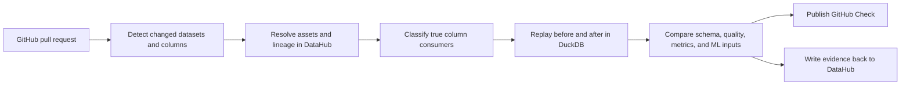

# ShadowGraph

**The pre-merge safety system for organizational data.**

ShadowGraph is a DataHub-powered CI gate that turns a proposed data change into
an evidence-backed merge decision. It is designed to resolve changed datasets
and columns against DataHub, traverse their true downstream consumers, replay
the affected lineage subgraph, and block pull requests that silently alter
critical metrics, dashboards, or ML features.

> **Project status:** the local end-to-end engine is implemented: immutable PR
> ingestion, live DataHub dataset/schema/lineage/owner context, true-consumer
> classification, bounded DuckDB replay, deterministic pass/block/inconclusive
> decisions, GitHub Check payloads, and idempotent DataHub evidence plans. The
> official open-source DataHub MCP Server and Skills are integrated and verified
> against local DataHub Core. External GitHub publication and DataHub mutation
> are implemented behind dry-run/approval boundaries but have not been executed
> because this local repository has no GitHub remote or publication credentials.

## The problem

Schema checks catch dropped columns and incompatible types. They do not catch a
field whose name and type stay the same while its meaning changes.

ShadowGraph's reference scenario changes `discount_percentage` from a whole
percentage (`25`) to a decimal fraction (`0.25`). Ordinary schema CI stays green,
but downstream revenue calculations and an ML feature silently change behavior.

ShadowGraph uses DataHub to answer *what is connected?* and an isolated replay
engine to answer *what actually changes?*

## How it works



The intended production state machine is deliberately small and inspectable:

```text
DETECT → RESOLVE → TRACE → REPLAY → COMPARE → DECIDE → RECORD
```

## Try the current vertical slice

Requirements:

- Node.js 22.13 or newer
- npm

```bash
git clone <your-fork-or-repository-url>
cd shadowgraph
npm install
npm run dev
```

Open [http://localhost:3000](http://localhost:3000), select **Run Shadow
Analysis**, watch the five analysis stages complete, then switch between
**Impact graph** and **Execution evidence**.

The current experience demonstrates:

- An interactive pull-request analysis
- DataHub lineage context visualization
- Static true-consumer and false-positive classification
- Immutable GitHub PR diff ingestion and evidence artifacts
- Before/after counterfactual evidence
- A merge-blocking decision trace
- Affected assets and responsible owners
- Responsive, keyboard-accessible product UI
- Example JSON and Markdown check outputs

The browser's current evidence values are deterministic reference data, which
keeps the hosted demo reliable. The DataHub API routes and MCP verification path
query live DataHub when it is configured.

Run the executable dangerous and safe golden paths:

```bash
npm run demo:golden
```

The dangerous path keeps the same schema while changing total revenue from
`357` to `-6870` and produces a failed Check payload. The equivalent refactor
keeps revenue at `357` and produces a successful Check payload. Both external
publication operations remain dry runs.

## Validation

```bash
npm test
npm run lint
npm run demo:golden
```

`npm test` creates the Cloudflare-compatible production build and verifies the
rendered product surface. See [docs/setup.md](docs/setup.md) for the DataHub
Quickstart and live integration environment.

With local DataHub running, verify the official read-only MCP interface:

```bash
npm run verify:datahub-mcp
```

## DataHub's role

DataHub is not a decorative catalog in ShadowGraph. It is the context and memory
layer that supplies:

- Dataset and column identity through DataHub URNs
- Table- and column-level lineage
- Downstream dashboards, metrics, features, and models
- Ownership and governance context for review routing
- A durable home for the final decision and validation evidence

Without that graph, the system would not know which subset of the data estate to
analyze or who needs to act on the result.

## Reference scenario

```diff
- discount_percentage / 100 as discount_rate
+ discount_percentage as discount_rate
```

The type and name remain valid, but the semantic scale changes. ShadowGraph
traces the affected column, excludes one unrelated downstream asset, and presents
four true consumers. The reference shadow run reports a `−24.75%` revenue change
and an ML distribution-drift score of `0.31`, so the merge is blocked.

Sample artifacts are available in [`examples/`](examples/):

- [`blocked-check.json`](examples/blocked-check.json) — machine-readable failed check
- [`safe-check.json`](examples/safe-check.json) — false-positive-free passing check
- [`change-evidence.md`](examples/change-evidence.md) — human-readable evidence record
- [`pr-check-comment.md`](examples/pr-check-comment.md) — proposed GitHub PR presentation

## Repository map

```text
app/                  Interactive ShadowGraph application
docs/                 Architecture, setup, demo, and judging notes
examples/             Sample reports and evidence outputs
tests/                Render and product-contract tests
.openai/              Sites deployment configuration
```

## Documentation

- [Architecture and trust boundaries](docs/architecture.md)
- [Local and integration setup](docs/setup.md)
- [Official DataHub MCP and Skills integration](docs/datahub-agent-integration.md)
- [GitHub pull-request ingestion](docs/github-action.md)
- [Golden-path demo scenario](docs/demo-scenario.md)
- [Under-three-minute demo script](docs/demo-script.md)
- [Hackathon judging alignment](docs/judging-alignment.md)
- [Roadmap](docs/roadmap.md)

## Implemented pipeline

1. DataHub MCP/Skills and live GraphQL context adapter
2. SQL/dbt immutable-diff classifier
3. Column-level true-consumer resolver
4. Bounded DuckDB before/after replay engine
5. Deterministic pass/block/inconclusive policy
6. Approval-gated GitHub Check publisher
7. Approval-gated, idempotent DataHub MCP document writeback
8. Optional local Ollama explanation (`qwen2.5:7b` by default)

Remaining submission operations—not engine implementation—are connecting a
real GitHub repository, exercising an authorized red/green Check and DataHub
writeback, hosting the final demo, and recording the submission video. See
[docs/roadmap.md](docs/roadmap.md).

## Contributing and security

Contributions are welcome. Read [CONTRIBUTING.md](CONTRIBUTING.md) before opening
a pull request and report vulnerabilities according to [SECURITY.md](SECURITY.md).
Participation is governed by [CODE_OF_CONDUCT.md](CODE_OF_CONDUCT.md).

## License

Licensed under the [Apache License 2.0](LICENSE).
