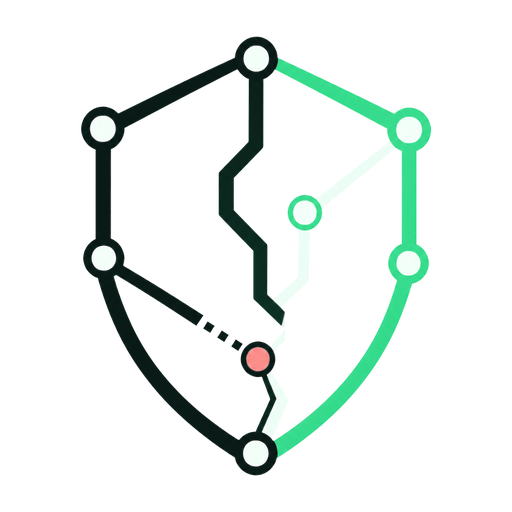
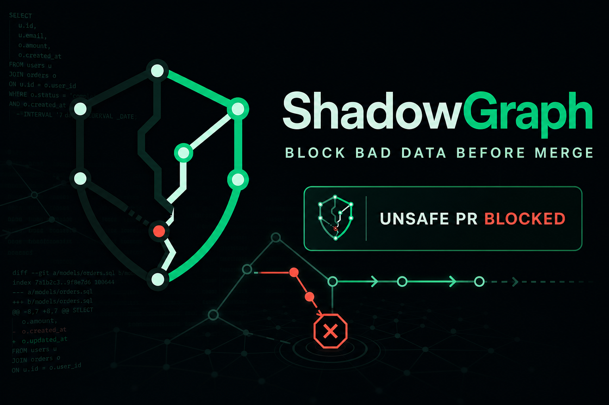
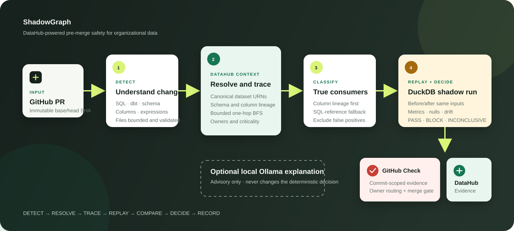
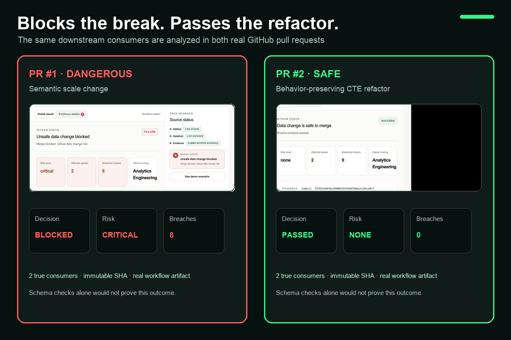
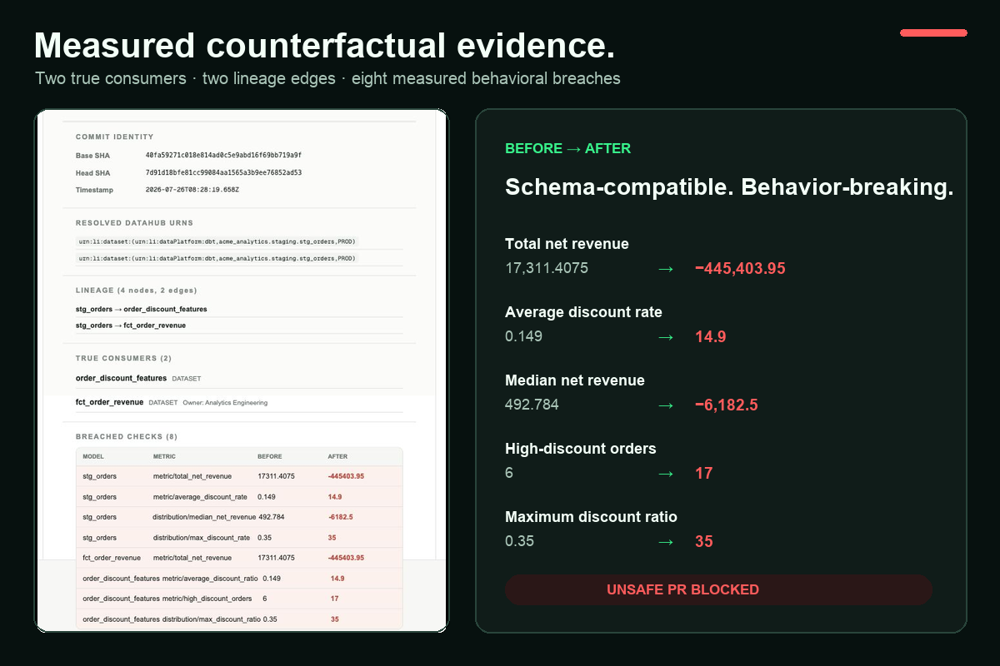
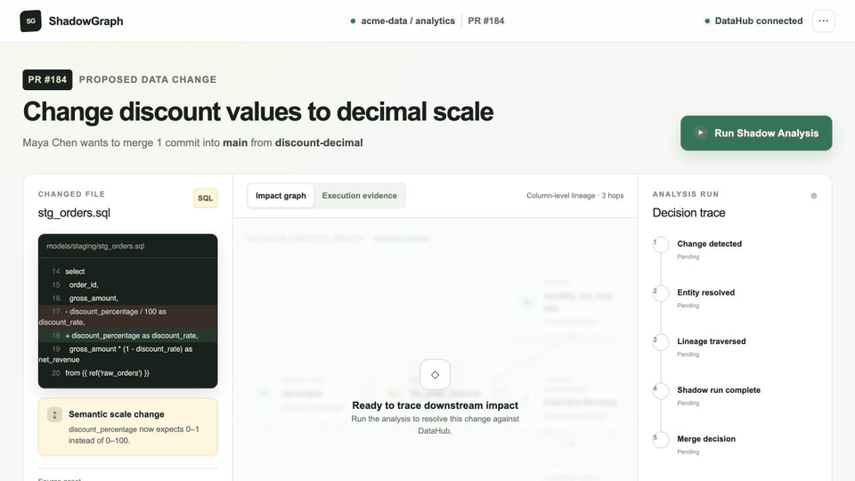

<p align="center">
  
</p>

<h1 align="center">ShadowGraph</h1>

<p align="center"><strong>Pre-merge safety for data changes — powered by DataHub.</strong></p>

<p align="center">
  <a href="LICENSE"></a>
  <a href="https://nodejs.org"></a>
  <a href="https://github.com/naman833/shadowgraph/actions"></a>
  <a href="https://github.com/naman833/shadowgraph/pulls"></a>
  <a href="https://datahubproject.io"></a>
</p>

<p align="center">
  <a href="https://github.com/naman833/shadowgraph/pull/1">Dangerous PR (blocked)</a> ·
  <a href="https://github.com/naman833/shadowgraph/pull/2">Safe PR (passed)</a>
</p>

<p align="center">
  
</p>

---

## What is ShadowGraph?

ShadowGraph is a CI gate that catches **silent breaking data changes** — the kind that pass schema validation because the column name and type stay the same, but the *meaning* changes.

It uses **DataHub** as its context layer to understand what's connected, and an isolated **DuckDB replay engine** to prove what actually changes when you modify a SQL model.

**The key insight:** Schema checks catch dropped columns. They don't catch `discount_percentage` switching from `0–100` to `0–1`. ShadowGraph does.

---

## Quickstart (start to finish)

### Prerequisites

| Tool | Version | Purpose |
|------|---------|---------|
| Node.js | ≥ 22.13 | Runtime |
| npm | ≥ 10 | Package manager |
| Git | Any | Clone the repo |
| Docker Desktop | ≥ 4.x (optional) | Required for local DataHub |
| Python | 3.8–3.11 (optional) | Required for `datahub` CLI |
| DataHub CLI | Any (optional) | Live lineage context |
| GitHub CLI (`gh`) | Any (optional) | Token for artifact download |

### 1. Clone and install

```bash
git clone https://github.com/naman833/shadowgraph.git
cd shadowgraph
npm install
```

### 2. Run the tests (verify everything works)

```bash
npm test          # Builds + runs 89 tests
npm run lint      # Lints all source
npm run demo:golden  # Runs the golden dangerous/safe scenarios
```

### 3. Start the interactive application

```bash
npm run dev
```

Open **http://localhost:3000** in your browser.

### 4. Load a real PR

The UI opens in PR selector mode:

1. **Owner**: `naman833` (pre-filled)
2. **Repository**: `shadowgraph` (pre-filled)
3. **PR number**: `1` (pre-filled)
4. Click **Load PR**

You'll see PR #1's real analysis evidence fetched live from GitHub:

| Field | Value |
|-------|-------|
| Title | Treat discount_percentage as a decimal fraction |
| Branch | `main` ← `demo/dangerous-discount-scale` |
| Head SHA | `7d91d18bfe81…` |
| Check | **failure** — "Unsafe data change blocked" |
| Risk | **critical** |
| Affected assets | **2** (`fct_order_revenue`, `order_discount_features`) |
| Breached checks | **8** (real DuckDB replay measurements) |
| Owner routing | **Analytics Engineering** |

### 5. View structured evidence

Click the **Evidence Details** tab to see:
- Real replay measurements (e.g., `total_net_revenue: 17311 → -445403`)
- Resolved DataHub URNs
- Lineage edges (parent → child)
- True consumer classification

### 6. Try the safe PR

Change PR number to `2` and click **Load PR**:
- Conclusion: **success**
- Risk: **none**
- Breached checks: **0**
- Same consumers detected, but no behavioral change

### 7. (Optional) Enable full evidence artifact download

The UI works without a token (shows Check result and risk level). For full
structured evidence (replay measurements, lineage), create `.dev.vars`:

```bash
printf 'GITHUB_TOKEN=%s\n' "$(gh auth token)" > .dev.vars
```

Restart the dev server. The token is server-side only and never sent to the browser.

### 8. (Optional) Start local DataHub

```bash
# Install the DataHub CLI (requires Python 3.8–3.11 and Docker running)
pip install 'acryl-datahub[datahub-rest]'

# Start DataHub (first run downloads ~4 GB of images)
datahub docker quickstart

# Initialize local credentials
datahub init --username datahub --password datahub

# Load ShadowGraph's demo datasets, lineage, and ownership
npm run ingest:demo-lineage
```

The UI header will change from "DataHub unavailable" to "DataHub connected".
Verify: `curl http://localhost:3000/api/datahub/health`

---

## How it works

```text
DETECT → RESOLVE → TRACE → REPLAY → COMPARE → DECIDE → RECORD
```

| Stage | What happens |
|-------|-------------|
| **Detect** | Parse SQL diffs from PR, classify semantic changes |
| **Resolve** | Match changed files to DataHub dataset URNs |
| **Trace** | Traverse downstream lineage (tables, dashboards, ML features) |
| **Replay** | Execute old + new SQL in DuckDB against seed data |
| **Compare** | Measure differences (revenue, nulls, distributions, schema) |
| **Decide** | Deterministic policy (never LLM) → block / pass / neutral |
| **Record** | Publish GitHub Check + upload evidence artifact |



---

## The proof: two real pull requests

Both change the same SQL file. Both keep every column name and type identical.
Ordinary schema CI passes both. **ShadowGraph separates them:**

| PR | Change | Result | Evidence |
|----|--------|--------|----------|
| [#1](https://github.com/naman833/shadowgraph/pull/1) | Removes `/100.0` — changes discount scale | **Blocked** | Revenue: $17k → −$445k |
| [#2](https://github.com/naman833/shadowgraph/pull/2) | Moves conversion into a CTE — equivalent | **Passed** | Revenue: $17k → $17k |

```diff
- discount_percentage / 100.0 as discount_rate
+ discount_percentage as discount_rate
```

The breached measurements from PR #1:

```
stg_orders:              metric/total_net_revenue       17311.41 → -445403.95
stg_orders:              metric/average_discount_rate   0.149 → 14.9
stg_orders:              distribution/max_discount_rate 0.35 → 35
fct_order_revenue:       metric/total_net_revenue       17311.41 → -445403.95
order_discount_features: metric/average_discount_ratio  0.149 → 14.9
order_discount_features: metric/high_discount_orders    6 → 17
order_discount_features: distribution/max_discount_ratio 0.35 → 35
stg_orders:              distribution/median_net_revenue 492.78 → -6182.5
```

---

## Blocks the break. Passes the refactor.

<p align="center">
  
</p>

---

## Measured counterfactual evidence

<p align="center">
  
</p>

---

## See it work

<p align="center">
  
</p>

---

## Key design decisions

| Decision | Why |
|----------|-----|
| **Never depends on an LLM for the merge decision** | No model can talk ShadowGraph into passing an unsafe change |
| **Missing evidence = neutral (blocked), never pass** | Can't prove safe → don't claim it is |
| **Everything is commit-scoped** | Analysis pinned to immutable head SHA |
| **Dry-run by default** | No writes without explicit `--publish-check` or `--record-evidence` |
| **Explicit source labeling** | UI shows exactly where data comes from |
| **No silent demo fallback** | Errors are shown, never hidden behind fake data |

---

## DataHub integration

DataHub is not decorative here. It provides:

| Capability | How ShadowGraph uses it |
|------------|------------------------|
| Dataset identity | Resolves SQL file changes to canonical URNs |
| Column-level lineage | Finds true downstream consumers |
| Ownership | Routes blocked PRs to the right team |
| Platform context | Distinguishes dbt, Snowflake, Looker, ML |
| Evidence storage | Persists decisions as DataHub Documents |
| MCP Server | Exposes catalog to Copilot agent skills |

### Verify the DataHub integration

```bash
# Health check
curl http://localhost:3000/api/datahub/health

# Entity resolution
curl 'http://localhost:3000/api/datahub/entity?q=stg_orders'

# Downstream lineage
curl -X POST http://localhost:3000/api/datahub/lineage \
  -H 'content-type: application/json' \
  -d '{"urn":"urn:li:dataset:(urn:li:dataPlatform:dbt,acme_analytics.staging.stg_orders,PROD)","depth":3}'

# Official DataHub MCP smoke test
npm run verify:datahub-mcp
```

---

## Run the CLI analysis

```bash
# Dangerous PR — exit code 1 (blocked)
npm run analyze:pr -- \
  --repository naman833/shadowgraph \
  --pull-request 1 \
  --base main \
  --head demo/dangerous-discount-scale \
  --output outputs/dangerous.json

# Safe PR — exit code 0 (passed)
npm run analyze:pr -- \
  --repository naman833/shadowgraph \
  --pull-request 2 \
  --base main \
  --head demo/safe-sql-refactor \
  --output outputs/safe.json
```

Exit codes: `0` safe · `1` blocked · `2` inconclusive · `3` command failure

---

## GitHub Actions CI

The workflow ([`.github/workflows/shadowgraph.yml`](.github/workflows/shadowgraph.yml)):

1. Checks out the **immutable head SHA** (not the moving merge ref)
2. Runs `npm test` to verify the project
3. Confirms DataHub is reachable
4. Runs the full analysis pipeline
5. Publishes a GitHub Check Run (pass/fail/neutral)
6. Uploads versioned evidence JSON as an artifact (`if: always()`)
7. Gates the merge on the ShadowGraph decision

Evidence artifacts are named `shadowgraph-pr-{number}-{head_sha}` and persist for 14 days.

---

## Project structure

```
shadowgraph/
├── app/                      # Web application (React + Cloudflare Workers)
│   ├── page.tsx              # PR evidence viewer UI
│   ├── globals.css           # Styling
│   └── api/                  # Server-side API routes
│       ├── datahub/          # Health, entity, lineage endpoints
│       ├── github/pr/        # GitHub PR metadata fetcher
│       └── shadowgraph/      # Combined evidence endpoint
│
├── src/                      # Core pipeline
│   ├── analysis/             # Change detection, consumer classification, decision
│   ├── cli/                  # CLI entry point for CI
│   ├── datahub/              # DataHub GraphQL client + evidence writeback
│   ├── github/               # Check Run builder, PR ingestion
│   ├── pipeline/             # Orchestration (detect → resolve → trace → decide)
│   ├── replay/               # DuckDB counterfactual engine
│   ├── llm/                  # Optional Ollama advisor (advisory only)
│   └── types/                # TypeScript view models
│
├── demo-project/             # dbt-like SQL models + seed CSVs for replay
├── tests/                    # 89 unit tests (node:test runner)
├── scripts/                  # CLI wrappers, golden scenarios, MCP smoke
├── .github/workflows/        # CI workflow
├── .agents/                  # Copilot agent skills (DataHub integration)
├── docs/                     # Architecture, setup, demo guides
├── examples/                 # Sample Check payloads and evidence
└── worker/                   # Cloudflare Worker entry point
```

---

## Environment variables

| Variable | Required | Purpose |
|----------|----------|---------|
| `GITHUB_TOKEN` | Optional | Server-side only. Enables artifact download + higher rate limits |
| `DATAHUB_GMS_URL` | Optional | DataHub GMS endpoint (default: `http://localhost:8080`) |
| `DATAHUB_TOKEN` | Optional | DataHub personal access token |
| `OLLAMA_ENABLED` | Optional | Enable local LLM advisor (`true`/`false`) |

**Important:** The web application runs in Cloudflare Workers runtime, which doesn't
inherit shell environment variables. For the dev server, put variables in `.dev.vars`:

```bash
printf 'GITHUB_TOKEN=%s\n' "$(gh auth token)" > .dev.vars
```

The CLI (`npm run analyze:pr`) runs in plain Node and reads from the shell environment.

---

## Data source indicators

The UI always shows where data comes from:

| Badge | Meaning |
|-------|---------|
| `LIVE GITHUB` | Fetched from GitHub API in real time |
| `LIVE DATAHUB` | DataHub GMS is reachable and healthy |
| `COMMIT-SCOPED EVIDENCE` | Workflow artifact matches the PR head SHA |
| `DEMO DATA` | User explicitly selected demo mode |
| `UNAVAILABLE` | Service is unreachable |
| `MISSING` | Evidence artifact not found or auth required |

---

## Validation commands

```bash
npm test                    # Build + 89 tests
npm run lint                # ESLint
npm run demo:golden         # Golden dangerous/safe scenarios
npm run verify:datahub-mcp  # DataHub MCP server smoke test (requires DataHub)
```

---

## Documentation

- [Architecture and trust boundaries](docs/architecture.md)
- [Local and integration setup](docs/setup.md)
- [DataHub MCP and Skills integration](docs/datahub-agent-integration.md)
- [GitHub Actions workflow](docs/github-action.md)
- [Golden-path demo scenario](docs/demo-scenario.md)
- [Roadmap](docs/roadmap.md)

---

## Contributing and security

Contributions are welcome. Read [CONTRIBUTING.md](CONTRIBUTING.md) before opening
a pull request and report vulnerabilities according to [SECURITY.md](SECURITY.md).

## License

Licensed under the [Apache License 2.0](LICENSE).
