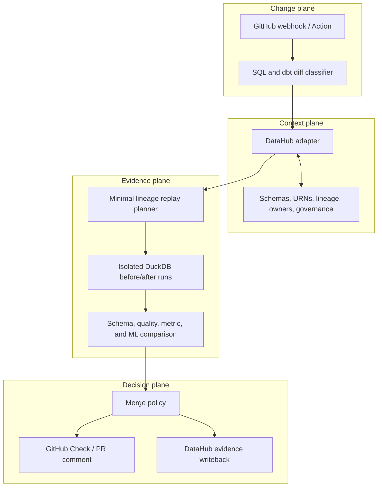

# Architecture

ShadowGraph is designed as an explainable CI state machine around DataHub's
metadata graph. Each stage emits structured evidence so a failed check can be
reproduced and audited.

## System view

## Stage contracts

| Stage | Input | Output | Failure behavior |
|---|---|---|---|
| Detect | Git diff and repository mapping | Changed asset, column, and change class | Mark analysis inconclusive |
| Resolve | Asset identity hints | Canonical DataHub URN and schema | Request mapping; do not guess |
| Trace | URN and changed columns | Bounded downstream lineage subgraph | Report incomplete context |
| Classify | Lineage plus consumer SQL | True consumers and exclusions with reasons | Prefer unknown over safe |
| Replay | Before/after code and sample data | Comparable output profiles | Block or mark inconclusive by policy |
| Decide | Static and runtime evidence | Pass, warn, block, or inconclusive | Default policy is fail closed for critical assets |
| Record | Decision bundle | PR check and DataHub evidence record | Preserve local report for retry |

## Current implementation

The current repository implements the interactive application and a deterministic
reference run. Its state progresses through detection, resolution, lineage,
execution, and decision; the UI renders the changed SQL, impacted graph, owners,
evidence, and merge outcome.

The following boundaries are represented by reference data and are not live yet:

- GitHub webhook ingestion and Check publishing
- DataHub MCP/GraphQL queries and evidence writeback
- SQL/dbt semantic diff parsing
- DuckDB execution against a sample-data copy

This separation is intentional: the product interaction can be tested and
demonstrated while adapters gain contract tests independently.

## Proposed evidence schema

`examples/blocked-check.json` captures the minimum stable result contract:

- Repository, PR, and immutable commit SHA
- Changed file, DataHub dataset URN, and column
- Change classification
- Lineage scope and true-consumer counts
- Replay row count and runtime
- Failed checks, thresholds, assets, and owners

Future versions should add an evidence hash, adapter versions, replay manifest,
source snapshot identifiers, and DataHub writeback URN.

## Trust and safety boundaries

- **Read before write:** DataHub discovery is read-only until the final evidence
  record is assembled.
- **No production mutation:** replay runs against static or isolated sample data.
- **Commit-scoped results:** a check belongs to one immutable SHA and becomes
  stale when the PR changes.
- **Explainable decisions:** every block names an asset, measured value,
  threshold, owner, and lineage path.
- **No invented identity:** unresolved assets produce an inconclusive result
  rather than a guessed URN.
- **Idempotent writeback:** the intended writeback key is repository + PR + SHA,
  allowing retries without duplicate evidence.

## Deployment shape

The UI is Cloudflare-compatible. The live service will additionally require a
trusted backend/worker for webhook verification, GitHub credentials, DataHub
access, and isolated replay execution. Secrets must remain server-side and must
never be exposed to the browser bundle.
